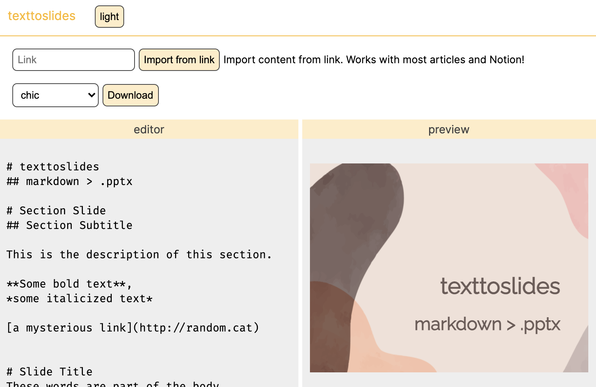

# texttoslides
## Make your presentation with Markdown!

Live site: [https://texttoslides.herokuapp.com/](https://texttoslides.herokuapp.com/)

Markdown-Convert Markdown to a .pptx presentation slides editor with live preview. Made with plain CSS and [pptxgenjs](https://github.com/gitbrent/PptxGenJS) (no [pandoc](https://pandoc.org/)).

See [ExamplePresentation.pptx](./examples/ExamplePresentation.pptx) for sample output.

## Features
* Link import
    * Grab article content with URL
    * Supports Notion
* Themes

## Contribute
This web app is currently a proof of concept. Pull requests and new issues are welcome.